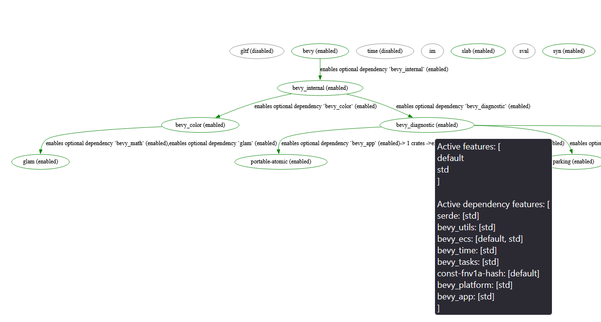

# Crate Feature Graph



A tool for visualising feature flow in a rust workspace, from the perspective of build time features.

## Features
- Compute feature flow throughout your workspace
- Filter out crates you don't want to see from the graph, but retain the connections
- Output as a dot graph or if the `dot_parser` feature is disabled as a text representation

## Usage
You can either filter the output or generate the entire graph.
If you filter out any crates, the edges will be "collapsed" at the edges of the filtered crates, so you can still see how features propagate through the graph.

For larger workspaces it is recommended to generate an svg so you can properly view the entire graph.

features obey the following syntax:
- `feature1` - enable feature1 in the root crate
- `crate/feature2` - enable feature2 in the crate crate (and implicitly enable crate as a dependency)
- `crate/default` - enable the default feature for the crate
- `default` - enable the default feature for the root crate

```bash
cargo install crate_feature_graph --features dot_parser

RUST_LOG=info cargo_feature_graph --manifest-path path/to/Cargo.toml --features="feature1,feature2" --only-show-crates="maybe_crate1,maybe_crate2"
```