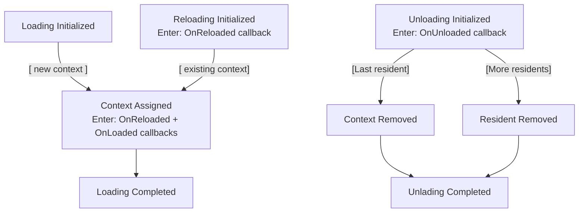

# Script Pipeline

Processing script atachments and detachments is all done by the script pipeline.

In versions prior to `16.0` the pipeline was represented by load unload commands, which atomically processed scripts. Since then the pipeline has been maassively overhauled to allow:
- Customizing callbacks during the process
- Budgeting frame time for the pipeline
- Allowing async steps in the process

The new pipeline works like this:
- A set of systems in `PostUpdate` "filter" incoming `ScriptAttachedEvent` and `ScriptDetachedEvent`'s as well as `ScriptAssetModifiedEvent`'s (some generated from asset events, others from component hooks). The filtered events are wrapped in `ForPlugin<P>(inner)` events based on the language of the underlying event's.
- A set of other systems then converts those into active `ScriptMachine`'s
- Then inside the `ScriptProcessingSchedule<P>`, which is only run if there are active machines, we tick each machine until it either errors or reaches its final state.

## Script Machines

### State Machine
Script loading is handled by the following state machines:


Hooks, such as `on_script_loaded` are implemented using `TransitionListener`'s which can be inserted into the `ActiveMachines` resource. This allows you to hook into various parts of the loading process and add your own callbacks, i.e.:

```rust
pub(crate) struct MyUnloadListener;
impl<P: IntoScriptPluginParams> TransitionListener<UnloadingInitialized<P>>
    for OnUnloadedForUnloadListener
{
    fn on_enter(
        &self,
        state: &mut UnloadingInitialized<P>,
        world: &mut World,
        ctxt: &mut Context,
    ) -> Result<(), ScriptError> {
        info!("doing unload things")
        Ok(())
    }
}

// example config, if you do this before the scripting plugin is initialized, the ordering of callbacks might be different to if you do this after.
fn main(&mut app: App) {
    let machines = app.world_mut().get_resource_or_init::<ActiveMachines<LuaScriptingPlugin>>();
    machines.push_listener::<UnloadingInitialized<LuaScriptingPlugin>>(MyUnloadListener);
}
```


## Timing & Order

The machine ticking by default is limited to 16ms per run (i.e. 60fps assuming it has the entirety of the frame to run). This is not entirely effective as some operations are not currently very fine grained, for example if a callback takes more than 16ms it will easilly hog the frame time. 

This is however effective when a lot of scripts are loaded in at once, as loading will be spread out over multiple frames.

You can override this and many other settings (including disabling the core callbacks) by changing the `ScriptLoadingPipeline<P>` settings via your scripting plugin's `set_pipeline_settings`.

The script loading/unloading order will look as follows:
- the order in which components are attached/detached, will determing what order scripts will be processed
- scripts are processed one-by-one, i.e. each machine is ticked to completion before the next one is started
    - meaning for example if two scripts are loaded, their `on_script_loaded` hooks will not run at the same "lockstep".
- loading/unloading might happen over multiple frames, depending on the pipeline's settings.

## Waiting for scripts to load

In order to check on the pipeline and figure out when everything is ready, you can use the `ScriptPipelineState<P>` system parameter in a system as shown in the `script_loading` [example](https://github.com/makspll/bevy_mod_scripting/blob/main/examples/script_loading.rs).